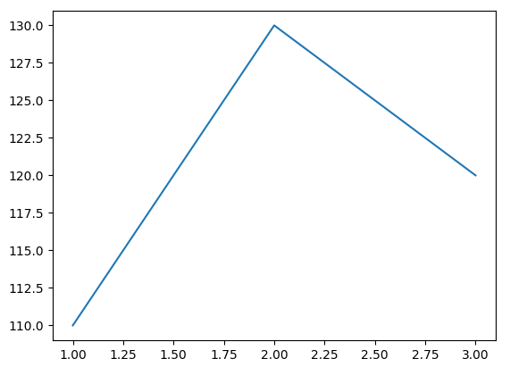
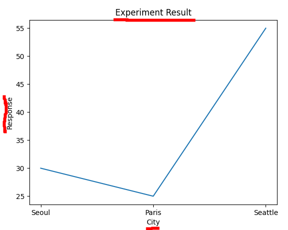
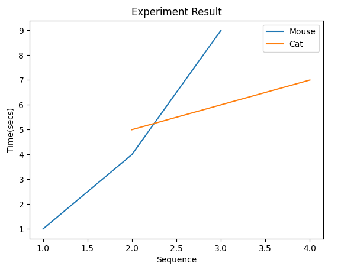
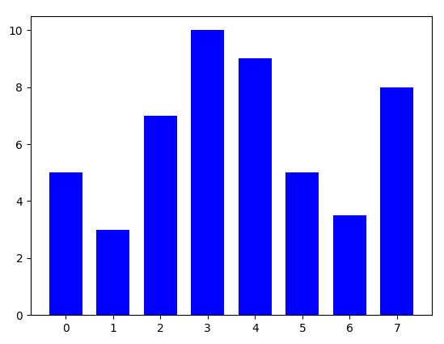
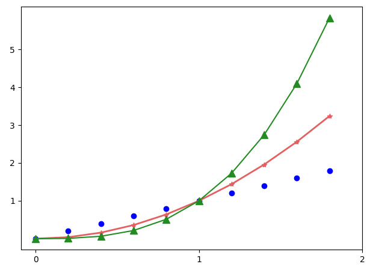

```
plt.figure(figsize=(10, 10))
plt.show()
```
- 크기가 10, 10 인 빈창을 띄운다.
- plt.show()는 생성된 모든 figure를 보여준다.


```
plt.plot([1, 2, 3], [110, 130, 120]) # plt.plot(x, y)
plt.show()  # plt를 보여준다.
plt.clf()  # plt 초기화 (초기화를 해 주지 않은 경우 위의 plot이 아래에 영향을 주게 된다.)
```
- plt.plot([1, 2, 3], [110, 130, 120]) 
    - (1, 110), (2, 130), (3, 120) 으로 연결되는 라인을 그린다.


## 타이틀과 label
```
plt.plot(["Seoul", "Paris", "Seattle"], [30, 25, 55])
plt.xlabel('City')
plt.ylabel('Response')
plt.title('Experiment Result')
```
- plt.plot(["Seoul", "Paris", "Seattle"], [30, 25, 55])
    - x 축은 각각의 도시이름이 y는 위치에 대한 라인 그래프가 디스플레이된다.


## Legend 출력
```
plt.plot([1, 2, 3], [1, 4, 9])  # Mouse
plt.plot([2, 3, 4], [5, 6, 7])  # Cat
plt.xlabel('Sequence')
plt.ylabel('Time(secs)')
plt.title('Experiment Result')
plt.legend(['Mouse', 'Cat'])
```

- legend는 각각의 plot에 대해 순서대로 출력된다.

## bar 차트
```
y = [5, 3, 7, 10, 9, 5, 3.5, 8]
x = range(len(y))
plt.bar(x, y, width=0.7, color="blue")
```


## subplot
plt.subplot(row, column, index)
row, column 은 전체 row, column 이고 index는 그중에서 몇번째인가를 확인 
```
plt.subplot(2, 1, 1)
plt.title('2, 1, 1')
plt.subplot(2, 1, 2)
plt.title('2, 1, 2')
```
```
plt.subplot(1, 2, 1)
plt.subplot(1, 2, 2) 
```
```
plt.subplot(2, 2, 1)
plt.subplot(2, 2, 2)
plt.subplot(2, 2, 3)
plt.subplot(2, 2, 4)
```

## ticks
xticks([]), yticks([]) 로 각각 x, y축에 대한 tick을 설정
```
plt.plot(x, x, 'bo')
plt.plot(x, x**2, color='#e35f62', marker='*', linewidth=2)
plt.plot(x, x**3, color='springgreen', marker='^', markersize=9)
plt.xticks(np.arange(0, 2, 0.2), labels=['Jan', '', 'Feb', '', 'Mar', '', 'May', '', 'June', '', 'July'])
plt.yticks(np.arange(0, 7), ('0', '1GB', '2GB', '3GB', '4GB', '5GB', '6GB'))
```
아래처럼 각각의 tick에 String을 표시할 수도 있음
```
plt.plot(x, x, 'bo')
plt.plot(x, x**2, color='#e35f62', marker='*', linewidth=2)
plt.plot(x, x**3, color='springgreen', marker='^', markersize=9)
plt.xticks(np.arange(0, 2, 0.2), labels=['Jan', '', 'Feb', '', 'Mar', '', 'May', '', 'June', ''])
plt.yticks(np.arange(0, 7), ('0', '1GB', '2GB', '3GB', '4GB', '5GB', '6GB'))
```



## grid
그리드를 표시
```
plt.grid(True)
```
## imshow
이미지를 출력
```
matplotlib.pyplot.imshow(X, 
                         cmap=None, 
                         norm=None, 
                         aspect=None, 
                         interpolation=None, 
                         alpha=None, 
                         vmin=None, 
                         vmax=None, 
                         origin=None, 
                         extent=None, *, 
                         filternorm=True, 
                         filterrad=4.0, 
                         resample=None, 
                         url=None, 
                         data=None, 
                         **kwargs)
                         
plt.imshow(train_images[i], cmap=plt.cm.binary)
```
cmap : colormap
https://matplotlib.org/stable/tutorials/colors/colormaps.html

### 이미지 출력하기
```
import matplotlib.image as img

image = img.imread('lena.jpg')
plt.imshow(image)
plt.show()
```